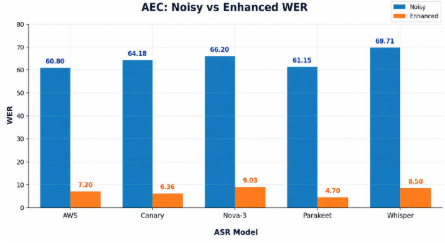
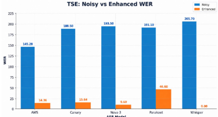

# MAVEN

**Meeami Audio Voice & Environment Dataset**

75 audio vectors · AEC · TSE · Speech Enhancement · BVS · Noisy/Enhanced pairs

**INTERSPEECH 2026 — Dataset Preview**

---

## Overview

Sounding clean is easy. Being understood is where most audio front-ends fail. Clean audio and correct transcripts shouldn't be a coin flip, but for most preprocessing blocks, they are.

MAVEN makes that trade-off measurable. It contains 75 audio vectors across Acoustic Echo Cancellation (AEC), Target Speech Extraction (TSE), and Speech Enhancement (SE), each provided as a matched noisy/enhanced pair, scored across five leading commercial ASR engines: AWS, Canary, Nova-3, Parakeet, and Whisper.

## Built to Be Heard — By People and Models

- Echo Cancellation
- Target Speaker Extraction
- Speech Enhancement
- Background Voice Suppression

## The Meeami Advantage: Clean AND Correct

Across MAVEN benchmarks, aggressive echo, wind, babble, and background-voice suppression can make audio sound tidy while degrading ASR performance. Meeami's audio front end does both: it suppresses real-world interference and reduces WER by up to 90% under the same conditions. Clean to the human ear. Correct for the machine.

## Benchmark Results: Noisy vs. Enhanced WER

**Fig. 1 — AEC: Noisy vs. Enhanced WER (20 vectors)**

**Fig. 2 — TSE: Noisy vs. Enhanced WER (20 vectors)**

### Speech Enhancement (NC) Benchmark

Enhanced audio holds under 9% WER across every ASR engine tested, versus a 26–49% noisy baseline.

| ASR Model | Noisy WER | Enhanced WER | Relative Change |
|---|---|---|---|
| AWS | 25.6 | 4.8 | -81% |
| Canary | 33.2 | 3.9 | -88% |
| Nova-3 | 43.38 | 5.7 | -87% |
| Parakeet | 26.6 | 5.0 | -81% |
| Whisper (Large V3) | 39.02 | 2.5 | -94% |

### Average WER Reduction

| Task | Avg. WER Reduction |
|---|---|
| AEC | -88.9% |
| TSE | -90.7% |
| SE | -86.2% |

---

Meet MAVEN and the Meeami audio front end at **Interspeech 2026**.
